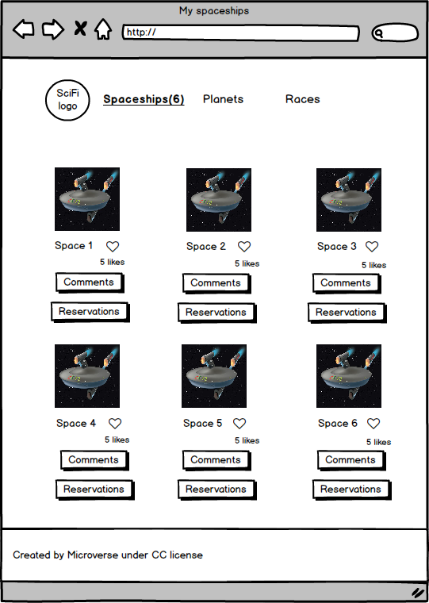

> Description the project.

Game Web App using Leaderboard API.

# Capstone Project JavaScript

> Capstone JavaScript using HTML, CSS, Jest, JavaScripts, GitFlow and Webpack

## Built With

- HTML
- CSS
- Javascript

## Feature used

- open API
https:///www.themealdb.com/api
### Prerequisites
 - Web browser and code editor of your choice
 
### Setup

Open a terminal or a git bash in the desired directory and run `https://github.com/rebel216/capstone_javascript.git`

To get a local copy up and running follow these simple example steps.

## Authors

👤 **David Isea**

- GitHub: https://github.com/AlucardSanin
- Twitter: https://twitter.com/cadivisea
- LinkedIn: https://www.linkedin.com/in/david-isea-560424236/

👤 **Neeraj Bhardwaj**

- GitHub: [@rebel216](https://github.com/rebel216)
- Twitter: [@rebel216](https://twitter.com/rebel216)
- LinkedIn: [rebel216](https://linkedin.com/in/rebel216)

## Show your support

Give a ⭐️ if you like this project!

## Acknowledgments

- Hat tip to anyone whose code was used
- Inspiration
- etc

## 📝 License

This project is [MIT](./MIT.md) licensed.
